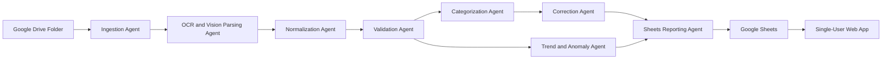

# MVP Design

## Architecture Overview

The MVP uses Google Drive as the input source, AI-assisted image extraction for screenshots, Google Sheets as the durable output, and a single-user web app as the visualization layer.

## Recommended Technology Stack

- Frontend: React or Next.js with TypeScript.
- Backend: TypeScript API routes or a small Python service.
- Google APIs: Drive API and Sheets API.
- AI extraction: a multimodal model that can process screenshots and return structured JSON.
- State store: Google Sheets tabs for MVP state, with the option to move to SQLite or Postgres later.
- Charts: a lightweight chart library for category and asset trends.

If implementation starts from scratch, TypeScript is preferred because the web app, Google API clients, and shared types can live in one project.

## Workflow

### 1. Ingestion

Input:

- Google Drive folder ID.
- Last processed checkpoint.
- Processed file IDs.

Output:

- Candidate source documents.

Behavior:

- List files in the dedicated Drive folder.
- Filter to image MIME types.
- Skip processed file IDs unless forced.
- Store file metadata for audit and idempotency.

### 2. OCR and Vision Parsing

Input:

- Source image.
- Source metadata.

Output:

- Raw OCR text.
- Transaction candidates.
- Asset snapshot candidates.

Behavior:

- Use an image-capable extraction prompt.
- Ask the model to return strict JSON.
- Preserve evidence text and source coordinate hints if available.
- Mark uncertain fields with confidence scores.

### 3. Normalization

Input:

- Extracted candidates.

Output:

- Normalized transactions.
- Normalized asset snapshots.

Behavior:

- Convert dates to ISO format.
- Convert amounts to decimals.
- Infer transaction type from signs, labels, and source context.
- Mask account labels.
- Attach source file ID to each row.

### 4. Validation

Input:

- Normalized rows.

Output:

- Valid rows.
- Review items.
- Anomaly candidates.

Behavior:

- Check missing required fields.
- Flag duplicate-looking rows.
- Detect impossible dates.
- Flag merchant names that look truncated or merged.
- Flag balance values that are suspiciously formatted.

### 5. Categorization

Input:

- Valid expense transactions.
- Merchant correction history.

Output:

- Categorized transactions.
- Low-confidence review items.

Behavior:

- Use deterministic merchant rules first.
- Use AI classification for unknown merchants.
- Return category, confidence, reason, and alternative categories.
- Route low-confidence rows to review queue.

### 6. Correction

Input:

- Review queue item.
- User response.
- Anomaly decision.

Output:

- Updated transaction or asset snapshot.
- Updated merchant memory.

Behavior:

- Store user corrections in the `Corrections` tab.
- Store anomaly decisions in the `Corrections` tab and preserve ignored or resolved anomaly status during summary refresh.
- Recompute summaries after corrections.
- Keep original extracted value for audit.

### 7. Sheets Reporting

Input:

- Transactions.
- Asset snapshots.
- Review items.
- Anomalies.

Output:

- Updated Google Sheet tabs.

Behavior:

- Upsert by stable IDs.
- Avoid duplicate rows on rerun.
- Keep raw source metadata separate from user-facing summaries.

### 8. Web Dashboard

Input:

- Google Sheet ID.

Output:

- Single-user dashboard.

Views:

- Monthly spending by category.
- Quarterly category trends.
- Asset balance trend.
- Review queue.
- Anomaly list.
- Next-best-action summary for failed files, pending reviews, anomalies, negative cash flow, and asset balance concerns.

## Agent Orchestration

The orchestrator should maintain a run state:

- `run_id`
- `started_at`
- `finished_at`
- `source_files_seen`
- `source_files_processed`
- `records_created`
- `records_updated`
- `review_items_created`
- `anomalies_created`
- `status`
- `errors_masked`

The orchestrator should stop only on unrecoverable configuration errors. File-level failures should be recorded and skipped so one bad screenshot does not block the whole month.

## Confidence Strategy

Use separate confidence values for:

- Extraction confidence.
- Normalization confidence.
- Category confidence.
- Validation confidence.

The final review decision should be based on the lowest relevant confidence and any hard validation failures.

Recommended default threshold:

- `LOW_CONFIDENCE_THRESHOLD=0.75`

## Error Handling

- Google Drive permission failure: show configuration error.
- Google Sheet missing: create if configured to do so, otherwise show setup error.
- AI extraction failure: add source file to processing errors and continue.
- Invalid JSON from model: retry with stricter repair prompt.
- Duplicate row risk: upsert by stable transaction ID.

## Stable ID Strategy

Use deterministic IDs to avoid duplicate rows:

- Source document ID: Google Drive file ID.
- Transaction ID: hash of source file ID, date, merchant, amount, and row index.
- Asset snapshot ID: hash of source file ID, account label, balance, and observed date.
- Review item ID: hash of target record ID and issue type.

## Security Notes

- Never log full OAuth tokens.
- Never log full account numbers.
- Do not store source screenshots in public folders.
- Keep local raw data out of git.
- Use least-privilege Google scopes.
