# Architecture And Rubric Evidence

Use this as a quick judge-facing companion to the Kaggle Writeup and video. It maps the product to the required submission assets, course concepts, and evaluation criteria.

## Architecture Snapshot

Use [architecture-diagram.svg](architecture-diagram.svg) as a technical architecture visual in the Writeup Media Gallery or video.

```mermaid
flowchart LR
  Drive["Google Drive screenshot folder"] --> Ingest["Ingestion agent"]
  Ingest --> Extract["Vision extraction agent"]
  Extract --> Normalize["Normalization agent"]
  Normalize --> Validate["Validation agent"]
  Validate --> Categorize["Categorization agent"]
  Categorize --> Review["Human review and correction agent"]
  Review --> Sheets["Google Sheets durable memory"]
  Sheets --> Summaries["Summary and anomaly agents"]
  Summaries --> Dashboard["Single-user dashboard and next-best actions"]
  Dashboard --> Review
```

## Kaggle Requirement Coverage

| Requirement | Current artifact |
| --- | --- |
| Kaggle Writeup with title, subtitle, track, and analysis | [KAGGLE_WRITEUP_DRAFT.md](KAGGLE_WRITEUP_DRAFT.md) |
| Media Gallery cover image | [cover-image.svg](cover-image.svg) |
| Architecture image for pitch/video | [architecture-diagram.svg](architecture-diagram.svg) |
| Attached video, 5 minutes or less, on YouTube | [VIDEO_SCRIPT.md](VIDEO_SCRIPT.md) and [MEDIA_GALLERY_PLAN.md](MEDIA_GALLERY_PLAN.md) |
| Public project link or public repo with setup instructions | README setup path, `.env.example`, and [SUBMISSION_PACKAGE_CHECKLIST.md](../SUBMISSION_PACKAGE_CHECKLIST.md) |
| Writeup under 2,500 words | Enforced by `scripts/docs-check.sh` |
| At least three course concepts | Multi-agent workflow, security features, deployability, and agent tool use are documented below |
| User-story and UI evidence | [USER_STORY_UI_REVIEW.md](USER_STORY_UI_REVIEW.md) |
| Evaluation scorecard | [KAGGLE_EVALUATION_SCORECARD.md](KAGGLE_EVALUATION_SCORECARD.md) |

## Required Course Concepts

| Course concept | Where to show it | Implementation evidence |
| --- | --- | --- |
| Agent / multi-agent system | Writeup, video, code | `src/lib/orchestrator/`, `src/lib/extraction/`, `src/lib/normalization/`, `src/lib/categorization/`, `src/lib/validation/`, `src/lib/corrections/`, `src/lib/summaries/`, `src/lib/anomalies/`, `src/lib/dashboard/insights.ts` |
| Antigravity | Video and development docs | `docs/prompts/antigravity-build-prompts.md` records the agentic build prompts used to shape the MVP |
| Security features | Code and video | `SECURITY.md`, `src/lib/privacy/redact.ts`, single-user email gate in dashboard pages, private screenshot cache under ignored `data/private/`, `scripts/privacy-check.sh`, `.gitignore`, `.env.example` |
| Deployability | Video and docs | Next.js app, `.env.example`, `scripts/preflight.sh`, `src/lib/setup/health.ts`, `npm run verify`, `npm run verify:ci`, `.github/workflows/ci.yml`, README setup path |
| Agent skills / tool use | Code and video | Google Drive ingestion in `src/lib/google/drive.ts`, Google Sheets durable memory in `src/lib/google/sheets.ts`, AI vision adapters in `src/lib/extraction/adapters.ts`, correction memory in `Corrections` tab |

See [COURSE_CONCEPT_COVERAGE.md](COURSE_CONCEPT_COVERAGE.md) for the full concept claim map, including concepts intentionally not claimed.

## Evaluation Category Mapping

| Evaluation area | Evidence to emphasize |
| --- | --- |
| Core concept and value | Personal finance screenshots are high-friction, privacy-sensitive, and error-prone; the assistant converts them into auditable records and prioritized decisions |
| Video clarity | Use [VIDEO_SCRIPT.md](VIDEO_SCRIPT.md): problem, why agents, architecture, demo, build, safety |
| Writeup quality | Use [KAGGLE_WRITEUP_DRAFT.md](KAGGLE_WRITEUP_DRAFT.md): problem, solution, architecture, UX, course concepts, safety, scope |
| Technical implementation | Modular agent workflow, typed domain model, strict extraction schema, Google Drive/Sheets integration, deterministic IDs, rerunnable runs, setup health, anomaly resolution |
| Meaningful AI integration | Vision extraction, evidence text, confidence scores, AI fallback categorization, human review for low-confidence output |
| Tool use | Drive folder source, Sheets as durable memory, Next.js route handlers, setup/verification scripts |
| Code quality | TypeScript domain types, route-level tests, focused unit tests, lint/type/build gates |
| Documentation | README, SECURITY, MVP notes, demo walkthrough, readiness audit, submission checklist, writeup/video/media assets |
| User experience | Dashboard action center, staged import review, review workbench, Next Best Actions, anomaly decisions, source evidence, and [USER_STORY_UI_REVIEW.md](USER_STORY_UI_REVIEW.md) |
| Safety | No secrets in repo, redacted errors, private screenshot retention, single-user gate, review-only note, no payment movement |

See [KAGGLE_EVALUATION_SCORECARD.md](KAGGLE_EVALUATION_SCORECARD.md) for the point-by-point 30/70 evaluation mapping.

## Current Verification Evidence

Use the latest `npm run verify` output in the final Writeup or video. The current verified gates are:

- Preflight setup check passes.
- Privacy check reports no tracked secrets or private artifacts.
- Docs check validates reviewer docs and submission assets.
- Unit and integration tests pass.
- TypeScript type check passes.
- Lint passes.
- Production build passes.
- Public CI-safe verification is available through `npm run verify:ci` and `.github/workflows/ci.yml`.
- Final external submission fields can be checked after publication with `npm run submission:final`.

## Honest Submission Notes

- The submitted MVP is Drive-first.
- Google Photos is documented as a future extension, not as implemented ingestion.
- A live hosted demo is optional; if not deployed, the public repository must include setup instructions.
- The final Kaggle submission still needs the actual YouTube URL and public project or repository URL pasted into Kaggle.
